## MealToGo 🎯

Search for restaurants in multiple cities and, get their details and save your favourite restaurants.

## Features 🔥

✔️ Authentication with email & password <br />
✔️ Render restaurants on Google/Apple Maps <br />
✔️ Google/Apple Maps <br />
✔️ Persistant data with local storage <br />
✔️ Performance improvement GraphQL caching <br />

## Screenshots 📸

<h4 align="center">Screenshots</h4>

| splash Screen                               | Animation                                           |
|---------------------------------------------|----------------------------------------------------:|
|  |  |

| Login                                           | Restaurant Detail                                           |
|-------------------------------------------------|------------------------------------------------------------:|
|  |  |

| Favourites                                           | Map                                           |
|------------------------------------------------------|----------------------------------------------:|
|  |  |

| Search                                           | Settings                                           |
|--------------------------------------------------|---------------------------------------------------:|
|  |  |


## Technologies used 🛠️

**Code**: _React Native_<br />
**Design**: _Styled Components_<br />
**Authentication**: _Firebase auth_<br />
**Map**: _Google/Apple Maps_<br />

## Usage 📋

<details open>
<summary>1. Server Setup</summary>

```bash
#1. clone this project
~ git clone https://github.com/oussamabouchikhi/MealsToGo.git
#2. cd into it
~ cd MealsToGo
#3.a install expo-cli globally (if you don have it)
~ npm i -g expo-cli
#3.b install yarn globally (if you don have it)
~ npm i -g yarn
#3.c install app dependencies
~ yarn
#4. run app
# a. On an Android emulator
~ yarn android
# b. On an ios simulator
~ yarn ios
# b. On your device
~ yarn start
# then scan the QRCode, but make sure to install expo client on your phone

```

_available scripts_

```bash
~ yarn start   # start the app (then choose where to run)
~ yarn android # run the app on an Android emulator
~ yarn ios     # run the app on an ios simulator
~ yarn web     # run the app on the browser (web version)
~ yarn eject   # eject app from expo to a normal app
~ yarn lint    # lint the app code
```

</details>

<details>
<summary>2. Firebase Setup</summary>
  
<details>
<summary>A. Create a Firebase Project</summary>

First, head over to [Firabse](https://firebase.google.com/). Tap on `+ Add a project` to Create a new project
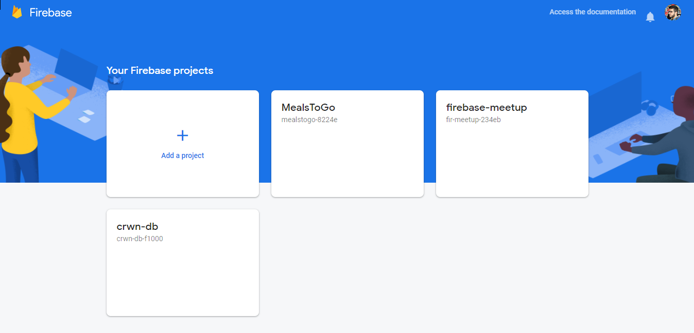


Give it a name <br/>
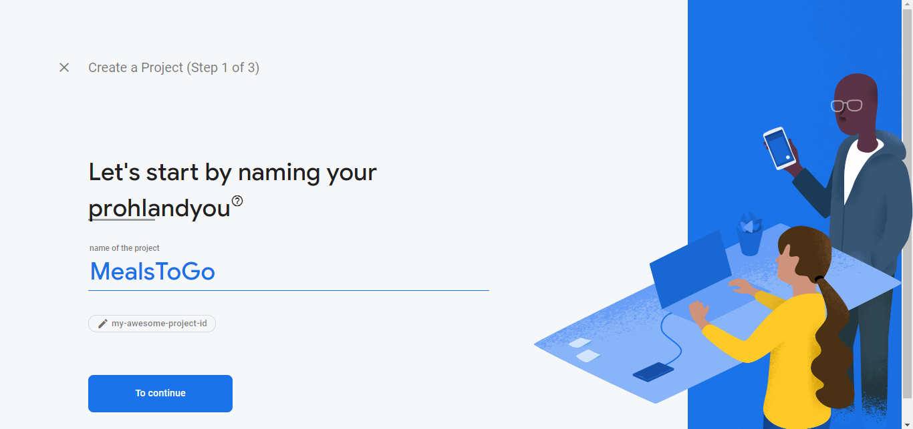

Turn off Analytics. Then click on `Create a project` <br/>
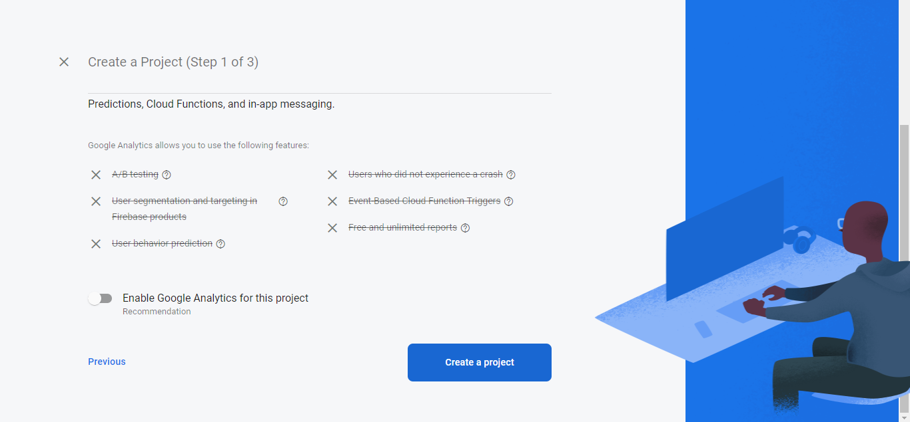

And now your project is ready  <br/>
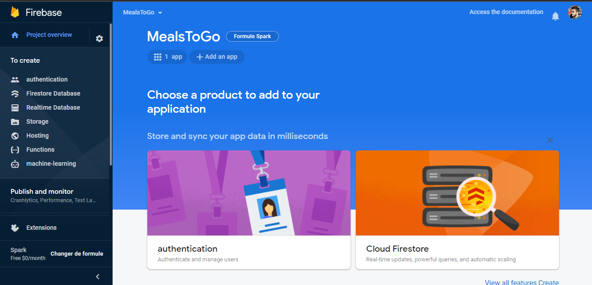

</details>
    
    
<details>
<summary>B. Setup Authentication</summary>
     
Click on `Get started` <br/>
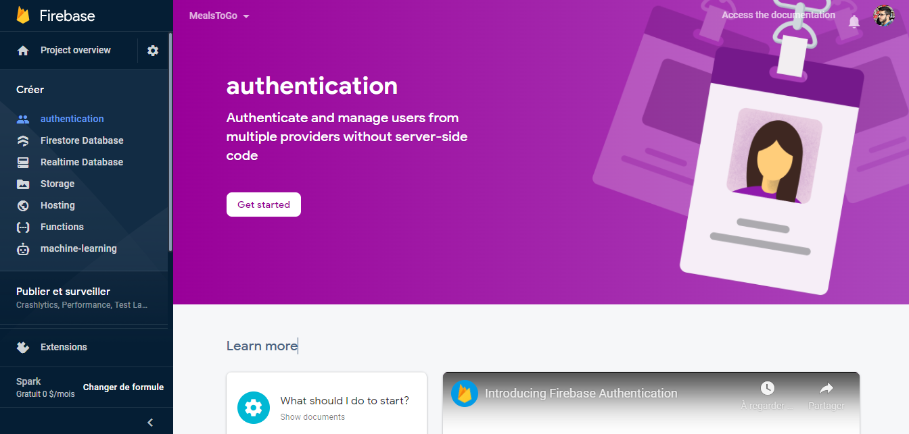

This is all types of authentication that we have, we want to enable the `Emai/Password` option to allow our users to sign-in with their email and password <br/>
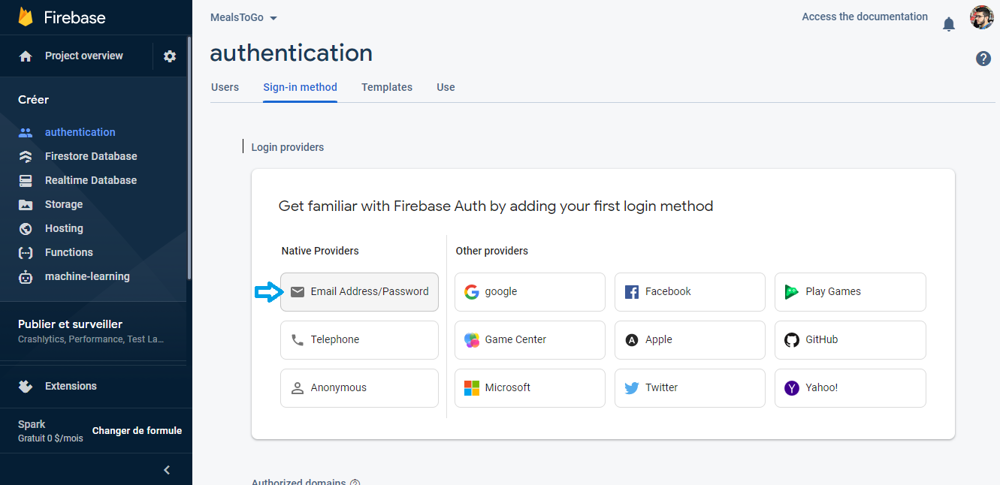

Click on it and then enable the option, then click `Save` <br/>
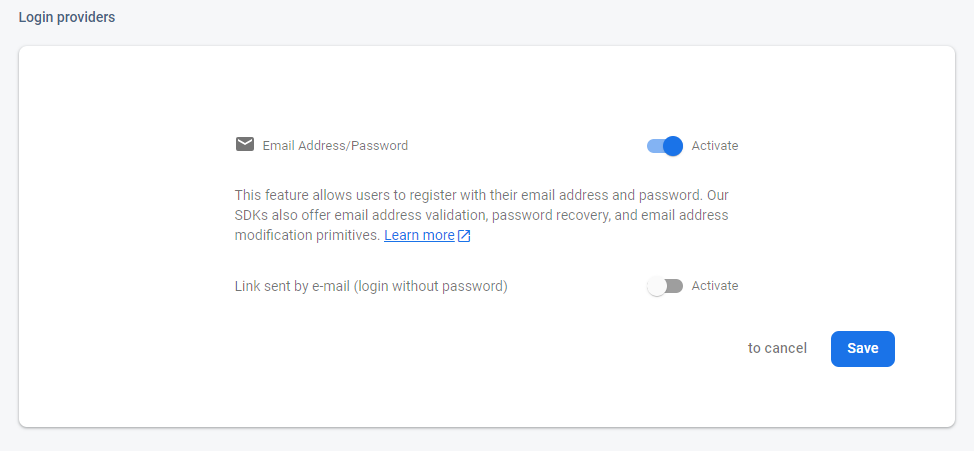

Now it is Enabled <br/>
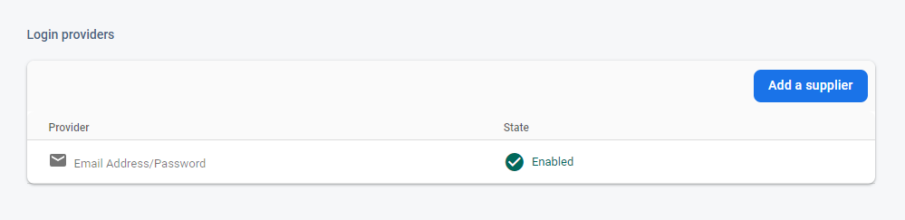

</details>

  <details>
<summary>C. Setup Firebase on the App</summary>
  Remember to replace the `firebaseConfig` variable in your `App.js` with your own config object from the firebase dashboard! Navigate to the project settings and scroll down to the config code. Copy the object in the code and replace the variable in your cloned code. <br/>

  
  You need to fill the config object with our project info from firebase <br/>
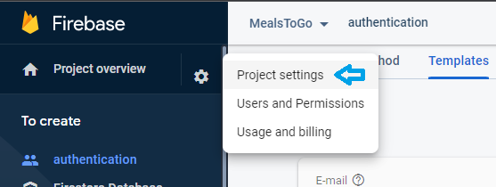
  
  Scroll down to the bottom, and select the 3rd option `</>` (which is the web sdk, because we’re using React native) <br/>
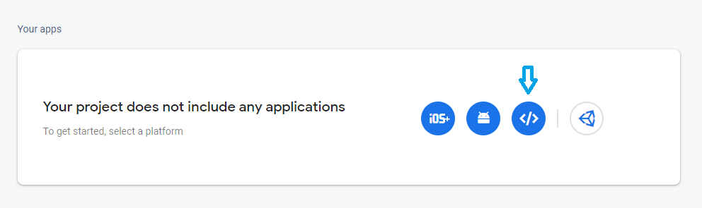
  
  Then add a nickname and register your app <br/>
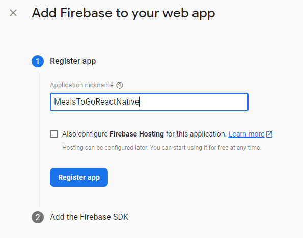
  
  And here you can find your project info, copy them then paste them in your app <br/>
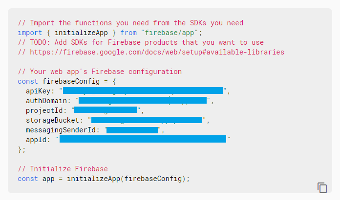

</details>
  

</details>

## Contributing 💡

Pull request are welcome but please open an issue and discuss what you will do before 😊

## License 📄

This project is open-sourced under the [MIT license](https://opensource.org/licenses/MIT).
